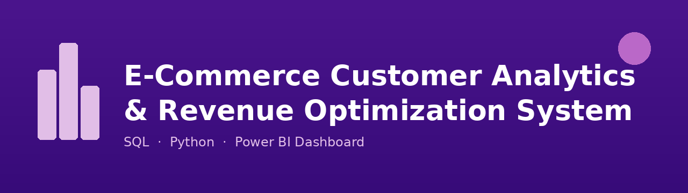

# E-Commerce Customer Analytics & Revenue Optimization System

End-to-end data pipeline on 541,909 e-commerce transactions — from raw data cleaning in SQL to an interactive live Power BI dashboard.

## Project Overview

E-commerce businesses generate huge volumes of transaction data, but most of it never gets turned into a decision. This project looks at:

- Which customers actually drive the business's revenue
- Whether recent, frequent buyers behave differently from one-time buyers
- Which customers are at risk of churning, and how much revenue that puts at risk
- How to combine SQL, Python and Power BI into one live pipeline instead of a one-off analysis

Full write-up: `Project_Full_Explanation.pdf`

## Repository Structure

- `SQLQuery1.sql` — Database setup, RFM query, segmentation logic
- `main.py` — Live SQL connection (Python), CLV calculation, charts
- `PowerBI.pbix` — Interactive Power BI dashboard
- `segment_chart.png` — Customer segment distribution (Python output)
- `churn_chart.png` — Churn status distribution (Python output)
- `Project_Full_Explanation.pdf` — Full write-up of the pipeline and findings

## Tools Used

- **SQL Server** — table setup, data cleaning, RFM calculation, segmentation
- **Python** (pandas, pyodbc) — live connection to SQL Server, CLV calculation, charts
- **Power BI** — live dashboard connected directly to SQL Server (native query)

## Data Cleaning

Source: UCI "Online Retail" dataset — UK-based online gift retailer, Dec 2010–Dec 2011.

- Raw dataset: 541,909 rows, 8 columns
- Removed rows with missing CustomerID (guest checkouts)
- Removed cancelled/returned orders (Quantity <= 0, InvoiceNo starting with 'C')
- Removed rows with missing InvoiceDate
- Left with 2,997 clean, analyzable customers

## Key Findings

**A small group of customers drives disproportionate value.** Just 53 "High Value" customers average ₹20,009 each — about 51x more than the average "Low Value" customer.

**High Value customers are also the most engaged.** They order 21.75 times on average and last purchased just 15.6 days ago, versus 142 days for Low Value customers.

**Volume beats value at the segment level.** The "Medium Value" segment (750 customers) generates 50.68% of total revenue — more than High Value — purely through repeat, moderate-sized orders.

**935 customers are at High Churn Risk.** They haven't purchased in over 180 days, representing a clear target list for win-back campaigns.

## Pipeline Design

SQL Server (live data) → Python (live connection, CLV, charts) → Power BI (live dashboard)

Every stage connects directly to the same SQL Server database — nothing passes through a CSV. Refreshing Python or Power BI pulls the latest data automatically.
